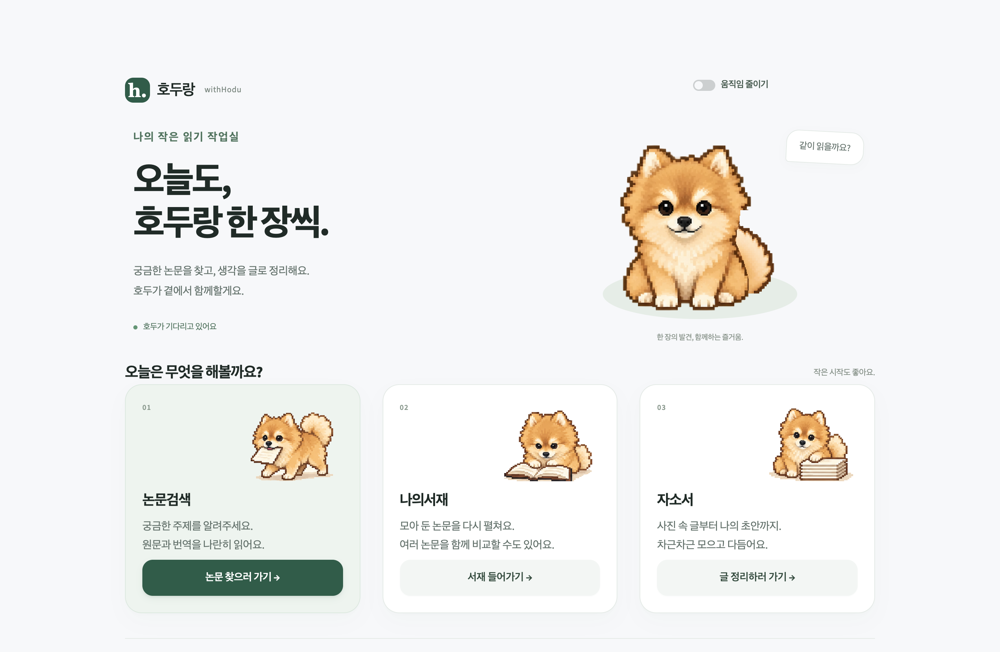
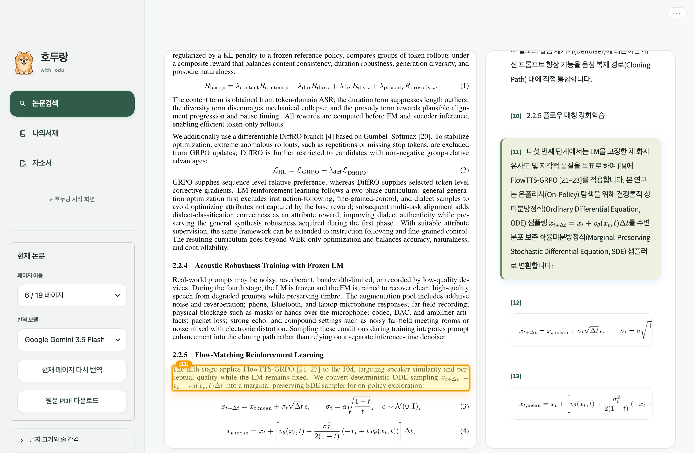

# 🐶 호두랑 (withHodu)

영어 논문을 원문과 한국어로 나란히 읽고, 읽은 논문을 서재에 모아 두고, 자기소개서 사진을 글로 옮겨 보관하는 개인 작업 공간입니다.

> 이름은 갈색 포메라니안 **호두**에서 왔습니다. 도트 호두가 맞이하는 시작 화면에서 논문 검색, 서재, 자기소개서 작업실로 들어갈 수 있습니다.

## 화면



**시작 화면** — 호두가 기다리는 첫 화면에서 논문검색, 나의서재, 자소서 작업실로 들어갑니다.



**논문 대역 리더** — *Qwen-Audio-3.0-TTS* 논문 6쪽을 Gemini 3.5 Flash로 번역한 화면입니다. 번역 문단에 마우스를 올리면 왼쪽 원문 문단이 함께 강조됩니다. 문장 속 수식은 KaTeX로, 줄 수식은 PDF에 그려진 원본 그대로 보여 줍니다.

---

호두 캐릭터 제작 자료: [도트 설계 노트](docs/design/hodu-pixel-design-notes.md) · [도트 레퍼런스 이미지](assets/hodu/hodu-pixel-reference-v1.png) · [프레임 애니메이션 제작 기록](docs/design/hodu-animation-production.md).

화면 제작 자료: [전체 화면·로딩·전환 설계](docs/design/withhodu-screen-storyboard.md) · [시작 화면 검증 기록](docs/design/withhodu-home-verification.md). 시작 화면과 작업 화면에 호두 테마와 프레임 애니메이션(대기·걷기·책 넘기기 등)을 적용했습니다.

---

## 할 수 있는 일

### 1. 논문 찾기와 대역 읽기
- **검색:** Google Scholar를 먼저 찾고, 결과가 부족하면 arXiv와 Semantic Scholar에서 보충합니다. Gemini가 찾으려는 연구에 맞춰 검색어를 다듬어 다시 검색할 수도 있습니다.
- **대역 리더:** 왼쪽에는 PDF 원문, 오른쪽에는 문단별 한국어 번역을 보여 줍니다. 원문 문단과 번역 문단이 서로 하이라이트로 연결됩니다.
- **번역 범위:** 제목·초록·절 제목·본문을 PDF 읽기 순서대로 번역하고, 표·그림·캡션·저자 정보·참고문헌은 번역하지 않습니다. 문장 속 수식은 KaTeX로, 줄 수식은 PDF 원본 이미지로 보여 줍니다.
- **번역 모델:** 키 없이 쓰는 Google 번역, 또는 Gemini(API 키 필요) 중에서 고릅니다. 페이지 단위로 번역하고, 필요하면 현재 페이지만 다시 번역합니다.
- **읽기 편의:** 대역·원문·번역 보기 전환, 글자 크기와 줄 간격 조절, 화면 양 끝에 마우스를 올려 쪽 넘기기, 현재 페이지 내용을 바탕으로 논문에 질문하기. 조작 메뉴는 화면 오른쪽 위에 마우스를 올리면 나타나고, 다음 페이지를 준비하는 동안 호두가 화면 위를 걸어갑니다.

### 2. 나의 서재
- 열어 본 논문은 검색 주제별 컬렉션에 PDF와 메타데이터가 자동으로 보관됩니다. 번역은 앱을 쓰는 동안만 유지되고 다시 열면 새로 번역합니다.
- 제목 변경, 컬렉션 이동, 삭제(확인 후), 원문 PDF 다운로드를 지원합니다.
- 여러 논문을 골라 구조·평가 지표·학습 방식을 비교한 **비교분석 보고서**를 만들고 Markdown으로 내려받습니다.

### 3. 자기소개서 작업실
- **자료 추가:** 자기소개서 사진(JPG·PNG·WEBP), PDF, 텍스트 파일을 올려 지원서 단위로 묶습니다.
- **전사:** Gemini Vision이 사진 속 글을 문항과 본문으로 나눠 옮깁니다. API 키가 없으면 오프라인 모의 전사로 동작합니다.
- **전사 검수:** 원본 사진(회전·확대)과 옮긴 글을 나란히 비교하며 고치고 승인합니다. 승인한 문항만 검색 대상이 됩니다.
- **근거 검색:** 키워드와 의미 검색을 함께 써서 문단을 찾고, 출처가 표시된 답변을 보여 줍니다. 참고 자소서의 경험을 내 경험처럼 답하지 않도록 구분합니다.
- **문체 편집:** 내 초안을 원하는 문체로 다듬되, 수치와 사실이 바뀌지 않았는지 확인한 뒤 새 버전으로 저장합니다.
- **보관·내보내기:** 문서별 Markdown·텍스트·ZIP 내보내기와 보관함 전체 백업을 지원합니다.

---

## 실행 방법

Python 3.10과 Streamlit 1.62에서 테스트했습니다.

```bash
pip install -r requirements.txt
./run.sh          # 또는: streamlit run app.py
```

브라우저에서 `http://localhost:8501`을 엽니다.

### 선택 설정 (`.env` 또는 환경변수)

| 이름 | 용도 |
| --- | --- |
| `GEMINI_API_KEY` | Gemini 번역·질문·전사·자기소개서 기능. 앱 사이드바의 **API 키 관리**에서 등록해도 됩니다. 없으면 Google 번역과 오프라인 모드로 동작 |
| `ESSAY_ARCHIVE_ROOT` | 자기소개서 보관 위치 (기본값 `~/EssayArchive`, 환경변수로만 지정) |
| `ESSAY_SEED_DIR` | 비공개 샘플·평가 자료 폴더(`data/seed.json`, `data/evaluation.json`). 없으면 관련 테스트는 건너뜀 |

### 데이터 저장 위치

| 자료 | 위치 |
| --- | --- |
| 논문 서재 | `~/PaperArchive/<컬렉션>/<논문>/` (PDF, 메타데이터, 표지) |
| 자기소개서 | `~/EssayArchive/` (SQLite DB, 원본 파일, 내보내기) |
| API 키 | `~/.gemini_paper_keys.json`, 프로젝트 `.env` |

모두 저장소 밖에 저장되며 `.gitignore`로 커밋되지 않게 막아 두었습니다.

---

## 테스트

```bash
python3 -m unittest discover -s tests -t .   # 논문 기능
python3 -m pytest tests/essay                # 자기소개서 기능 (pytest 필요)
```

`ESSAY_SEED_DIR`가 없으면 비공개 자료가 필요한 자기소개서 테스트 4개는 이유를 표시하고 건너뜁니다.

---

## 프로젝트 구조

```
├── app.py              # Streamlit 진입점 (검색·서재·리더 화면 전환)
├── run.sh              # 실행 스크립트
├── assets/hodu/        # 호두 도트 아틀라스와 프레임 애니메이션
├── core/               # 검색, PDF 파싱, 번역, 수식 변환, 하이라이트, 질문, 비교분석
│   └── essay/          # 자기소개서 저장소, 전사, 태그, 검색, 근거 답변, 문체 편집, 백업
├── ui/                 # 사이드바, 서재, 리더 화면, 공통 스타일
│   └── essay/          # 자기소개서 작업실 탭 화면
├── tests/              # 논문 기능 테스트
│   └── essay/          # 자기소개서 기능 테스트
└── docs/               # 디자인 검수 기록, README 화면 캡처, 공개 준비 체크리스트
```
