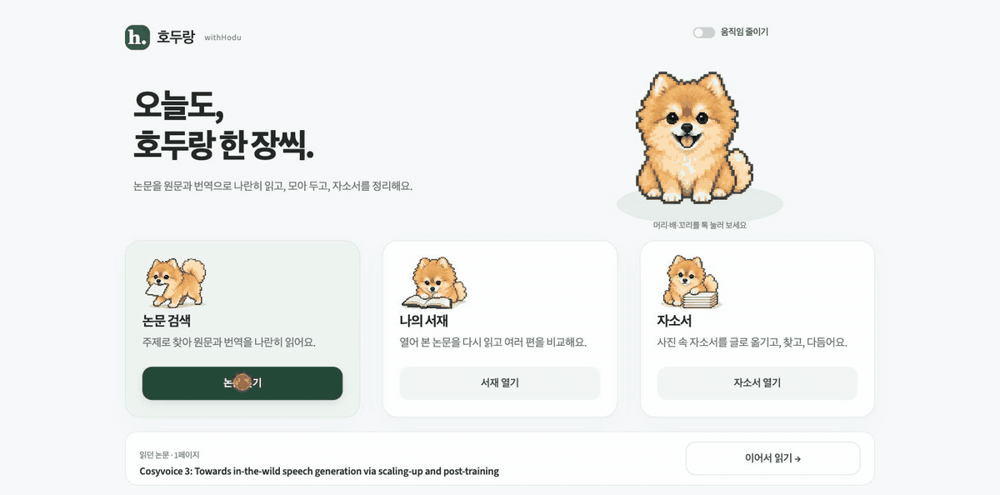
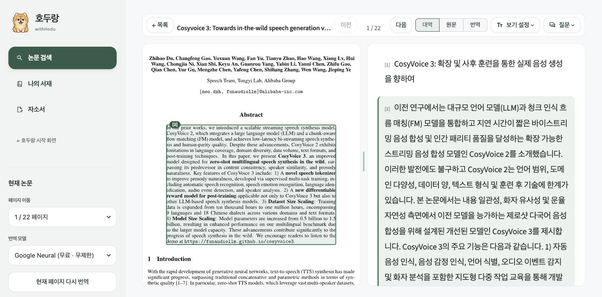

<div align="center">


# 호두랑 · withHodu

**영어 논문을 한국어 번역과 나란히 읽는 논문 리더기.**

Side-by-side English → Korean research paper translator.




</div>

## 시작하기

```bash
git clone https://github.com/4dong/withHodu-paper-translator.git
cd withHodu-paper-translator
pip install -r requirements.txt && streamlit run app.py
```

브라우저에서 `http://localhost:8501`이 열립니다. API 키가 없어도 Google 신경망 번역으로 바로 읽을 수 있습니다.

## Why make this?

Moonlight로 논문을 읽다가 무료로는 한 주에 3 편밖에 못 읽는 게 아쉬웠습니다. 요즘 번역이 그렇게 어려운 일도 아닌데 말이죠. 그래서 원문 옆에 번역을 붙여 주는 부분만 직접 만들었습니다.

<sub>Moonlight와 관련 없는 개인 프로젝트입니다.</sub>

## Function

- **논문 검색** — Google Scholar에서 찾고, 부족하면 arXiv와 Semantic Scholar로 채웁니다.
- **나란히 읽기** — 왼쪽은 PDF 원문, 오른쪽은 문단별 번역. 번역 문단에 마우스를 올리면 원문 문단이 같이 표시됩니다.
- **수식은 그대로** — 문장 속 수식은 KaTeX로, 줄 수식은 PDF 원본 이미지로 보여 줍니다. 표·그림·참고문헌은 번역하지 않습니다.
- **번역 엔진 선택** — 키 없이 쓰는 Google 번역, 또는 Gemini(개인 API 키 필요).
- **서재** — 열어 본 논문은 PDF째 폴더별로 저장됩니다. 여러 편을 골라 비교 보고서도 만들 수 있습니다.
- **논문에 질문** — 지금 보는 페이지를 바탕으로 Gemini에게 물어봅니다.



<details>
<summary><b>🧪 실험실: 자기소개서 작업실</b></summary>

논문과는 별개로 붙여 둔 실험 기능입니다.

- 자기소개서 사진(JPG·PNG·WEBP), PDF, 텍스트를 올리면 Gemini Vision이 문항과 본문으로 나눠 옮겨 적습니다. 키가 없으면 오프라인 모의 전사로 동작합니다.
- 원본 사진과 옮긴 글을 나란히 놓고 고친 뒤 승인해야 합니다. 승인한 문항만 검색됩니다.
- 키워드·의미 검색으로 문단을 찾고, 출처를 붙여 답합니다. 참고 자소서의 경험을 내 경험처럼 쓰지 않도록 구분합니다.
- 초안 문체를 다듬되 수치와 사실이 바뀌지 않았는지 확인하고 새 버전으로 저장합니다.
- Markdown·텍스트·ZIP으로 내보내고 보관함 전체를 백업할 수 있습니다.

</details>

## 더 보기

<details>
<summary>설정 (<code>.env</code> 또는 환경변수)</summary>

| 이름 | 용도 |
| --- | --- |
| `GEMINI_API_KEY` | Gemini 번역·질문·전사. 앱 사이드바 **API 키 관리**에서 넣어도 됩니다. 없으면 Google 번역과 오프라인 모드로 동작 |
| `PAPER_ARCHIVE_ROOT` | 논문 서재 위치 (기본값 `~/PaperArchive`) |
| `ESSAY_ARCHIVE_ROOT` | 자기소개서 보관 위치 (기본값 `~/EssayArchive`) |
| `ESSAY_SEED_DIR` | 비공개 샘플·평가 자료 폴더. 없으면 관련 테스트는 건너뜀 |

번역은 페이지 단위로 합니다. Google이 요청을 막으면 5분 동안 쉬었다가 다시 시도합니다.

</details>

<details>
<summary>데이터 저장 위치</summary>

| 자료 | 위치 |
| --- | --- |
| 논문 서재 | `~/PaperArchive/<폴더>/<논문>/` (PDF, 메타데이터, 표지) |
| 자기소개서 | `~/EssayArchive/` (SQLite DB, 원본 파일, 내보내기) |
| API 키 | `~/.gemini_paper_keys.json`, 프로젝트 `.env` |

모두 저장소 밖에 저장되고 `.gitignore`로 커밋되지 않게 막아 두었습니다. 번역 결과는 앱을 쓰는 동안만 유지됩니다.

</details>

<details>
<summary>테스트</summary>

```bash
python3 -m unittest discover -s tests -t .   # 논문 기능
python3 -m pytest tests/essay                # 자기소개서 기능
```

</details>

<details>
<summary>프로젝트 구조</summary>

```
├── app.py          # Streamlit 진입점
├── core/           # 검색, PDF 파싱, 번역, 수식, 하이라이트, 질문, 비교분석
│   └── essay/      # 자기소개서 기능
├── ui/             # 화면
├── assets/hodu/    # 호두 도트 그림과 애니메이션
├── tests/
└── docs/           # 디자인 기록, 화면 캡처
```

</details>

<details>
<summary>호두 제작 기록</summary>

이름은 갈색 포메라니안 **호두**에서 왔습니다.

- [도트 설계 노트](docs/design/hodu-pixel-design-notes.md) · [레퍼런스 이미지](assets/hodu/hodu-pixel-reference-v1.png) · [프레임 애니메이션 제작 기록](docs/design/hodu-animation-production.md)
- [화면·로딩·전환 설계](docs/design/withhodu-screen-storyboard.md) · [시작 화면 검증 기록](docs/design/withhodu-home-verification.md)

</details>

<details>
<summary>개발 방식</summary>

AI 코딩 도우미(Claude Code, OpenAI Codex)와 함께 만들었습니다. 기능 방향과 화면은 직접 정하고 검수했고, 구현은 테스트와 브라우저 확인을 거쳐 반영했습니다. 커밋의 `Co-Authored-By`는 그 기록입니다.

</details>

## English

withHodu is a local Streamlit app for reading English research papers next to a Korean translation. Search Google Scholar / arXiv / Semantic Scholar, open the PDF, and read each paragraph side by side — hover a translation to highlight its source paragraph. Math stays intact (KaTeX + original equation images). Works with free Google Translate out of the box; Gemini is optional.

## 라이선스

코드는 [MIT](LICENSE)입니다. 호두 캐릭터 그림과 애니메이션(`assets/hodu/`, 화면 캡처 속 호두 포함)은 MIT에 포함되지 않으며 모든 권리를 보유합니다. [호두 에셋 안내](assets/hodu/NOTICE.md)를 참고하세요.
